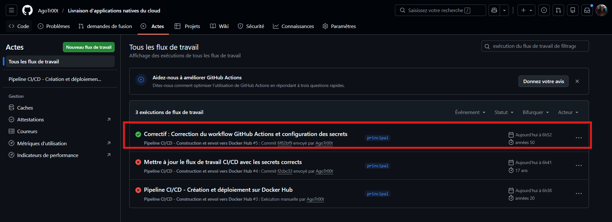
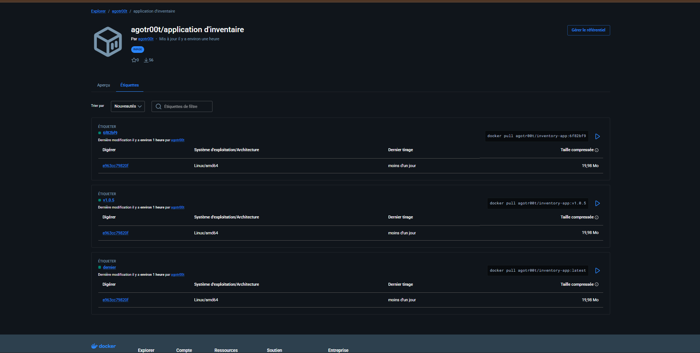
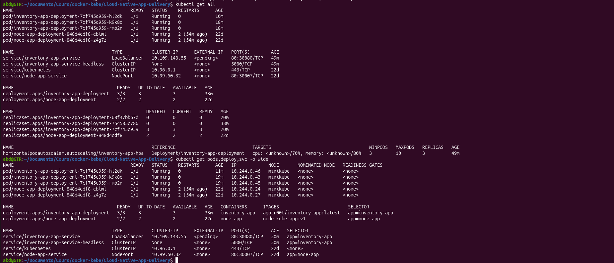
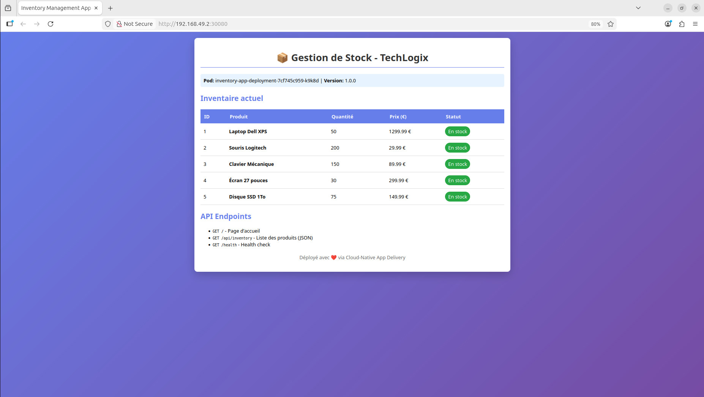

# TechLogix Inventory - Cloud-Native App Delivery

<div align="center">
  
[](https://github.com)
[](https://www.docker.com)
[](https://kubernetes.io)

**Application de gestion d'inventaire avec déploiement cloud-native (Docker + Kubernetes + CI/CD)**

**Auteur : Atigou, AWA et Abdou Khadre (AGoTr00t)**

</div>

---

## Table des matières
- [1. Lancer l'application en local avec Docker](#1-lancer-lapplication-en-local-avec-docker)
- [2. Configuration du pipeline CI/CD](#2-configuration-du-pipeline-cicd)
- [3. Commandes kubectl pour Kubernetes](#3-commandes-kubectl-pour-kubernetes)
- [4. Captures d'écran](#4-captures-décran)

---

## 1. Lancer l'application en local avec Docker

### 1.1 Prérequis

| Logiciel | Version | Commande de vérification |
|----------|---------|--------------------------|
| Docker | 20.10+ | `docker --version` |
| Git | 2.30+ | `git --version` |

### 1.2 Cloner le dépôt

```bash
# Clonez le dépôt
git clone https://github.com/AGoTr00t/Cloud-Native-App-Delivery.git
cd Cloud-Native-App-Delivery

# Vérifiez le contenu
ls -la
```

### 1.3 Construire l'image Docker
```bash
# Construire l'image
docker build -t techlogix-inventory:local .

# Vérifier que l'image a été créée
docker images | grep techlogix-inventory
```

### 1.4 Lancer le conteneur
```bash
# Lancer le conteneur
docker run -d -p 5000:5000 --name inventory-app techlogix-inventory:local

# Vérifier que le conteneur tourne
docker ps
```

### 1.5 Tester l'application
```bash
# Voir les logs
docker logs inventory-app

# Tester avec curl
curl http://localhost:5000
curl http://localhost:5000/healthz
curl http://localhost:5000/api/inventory

# Ouvrir dans le navigateur
# http://localhost:5000
```

### 1.6 Arrêter et nettoyer
Dans le cadre de tests local
```bash
# Arrêter le conteneur
docker stop inventory-app

# Supprimer le conteneur
docker rm inventory-app
```

## 2. Configuration du pipeline CI/CD
### 2.1 Structure du workflow

Vouz pouvez consulter le fichier suivants :
```bash
.github/workflows/ci-cd.yml
```

### 2.2 Configuration des secrets GitHub
Pour cette etapes il faut configurer 2 secrets dans qui corresponds a deux variables dans le fichier `ci-cd.yml` le `DOCKER_HUB_USERNAME` et `DOCKER_HUB_TOKEN` donc les valeurs correspond au `username` et `TOKEN` generer avec DOCKER HUB. Cela vas permettre au Pipeline CI/CD de recupere l'image push sur Docker HUB

```bash
DOCKER_HUB_USERNAME	AGoTr00t
DOCKER_HUB_TOKEN <a definir>
```

## 3. Commandes kubectl pour Kubernetes
### 3.1 Démarrer Minikube
```bash
# Démarrer Minikube
minikube start --memory=3072mb

# Vérifier le cluster
kubectl cluster-info
kubectl get nodes
```

### 3.2 Déployer l'application
```bash
# Appliquer les manifestes
kubectl apply -f k8s/deployment.yaml
kubectl apply -f k8s/service.yaml

# Ou en une seule commande
kubectl apply -f k8s/
```

3.3 Vérifier le déploiement
```bash
# Lister les ressources Pods, deployment et service
kubectl get all

# Voir les logs
kubectl logs -l app=inventory-app --tail=50

# Voir les événements
kubectl get events --sort-by='.lastTimestamp'
```

### 3.4 Tester l'application
```bash
# Obtenir l'URL
minikube service inventory-app-service --url

# Tester avec curl
curl http://192.168.49.2:30080

# Ouvrir dans le navigateur
minikube service inventory-app-service
```

3.5 Tester le scaling
```bash
# Augmenter les réplicas
kubectl scale deployment inventory-app-deployment --replicas=3
kubectl get pods -w
```

## 4. Captures d'écran

### 4.1 Pipeline CI/CD réussi (GitHub Actions)

Pipeline GitHub Actions avec tous les jobs en vert


### 4.2 Image sur Docker Hub

Image inventory-app sur Docker Hub avec les tags latest et v1.0


### 4.3 Cluster Kubernetes
```bash
kubectl get all
```
3 pods, 1 deployment et 1 service LoadBalancer actifs


4.4 Application dans le navigateur

Application accessible via http://<votre_url>:30080


<div align="center">
Date de livraison : 15 mars 2026
Auteur : Atigou, AWA et Abdou Khadre (AGoTr00t)

</div>
